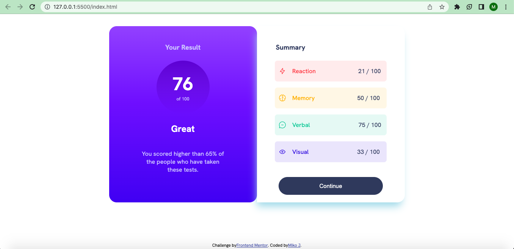
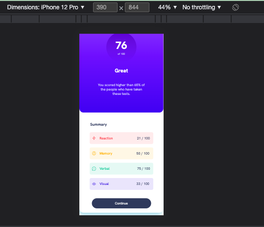

# Frontend Mentor - Results summary component solution

This is a solution to the [Results summary component challenge on Frontend Mentor](https://www.frontendmentor.io/challenges/results-summary-component-CE_K6s0maV).

## Table of contents

- [Overview](#overview)
  - [The challenge](#the-challenge)
  - [Screenshot](#screenshot)
  - [Links](#links)
  - [Built with](#built-with)
  - [What I learned](#what-i-learned)
- [Author](#author)
- [Acknowledgments](#acknowledgments)

## Overview

### The challenge

Users should be able to:

- View the optimal layout for the interface depending on their device's screen size
- See hover and focus states for all interactive elements on the page

### Screenshot





### Links

- Solution URL: (https://jamienorthman.github.io/results-summary-component/)

### Built with

- HTML
- CSS Flexbox
- Javascript

### What I learned

The main purpose of this project was to become more comfortable using Flexbox on my own. The summary and result elements should have been in one container to look more like the design. Maybe I should have tried using spans for the scores to match the design's colors more perfectly. Figuring out how to apply hsla colors with linear-gradient was also challenging—took a lot of googling! I used JSON data, fetch API and promises for the first time. When creating HTML elements for the JSON, it was difficult to assign each element a different color based on its index. I probably could have used nth-child() in CSS to avoid this, though.

I made various `<div>` elements to act as parent flex containers:
```html
<div class="result-container">
      <h4 class="result-header">Your Result</h4>
      <div class="total-score">
        <span><h2 class="score">76</h2></span>
        <p class="of-100">of 100</p>
      </div>
    
      <h3 class="great-header">Great</h3>
      <p class="result-text">You scored higher than 65% of the people who have taken these tests.</p>
</div>
```
I set a media query to give the project a nice mobile design:
```css
@media (max-width: 600px) {
    .main-container {
        display: flex;
        flex-direction: column;
        margin: 0;
    }
    .summary-container {
        border-bottom-left-radius: 20px;
    }
    .result-container {
        border-top-left-radius: 0px;
        border-top-right-radius: 0px;
    }
    .attribution {
        margin-top: 50px;
    }
}
```
I used a fetch API for the first time and practiced using promises:
```js
async function populateHTML () {
    const response = await fetch("data.json");
    const jsonData = await response.json();

jsonData.forEach()
```

## Author
- Miko Jeffries
- Frontend Mentor - [@jamienorthman](https://www.frontendmentor.io/profile/jamienorthman)

## Acknowledgments

Thanks Max for helping me with the JSON file.
